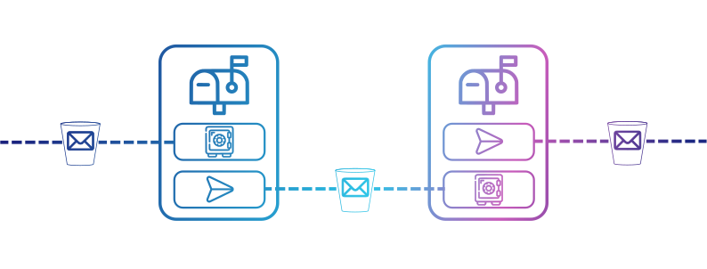

## Problem
Email is a vital communication tool in today's world, but it has numerous issues that cause dissatisfaction among users. The problems range from spam emails to overwhelming inboxes, making email frustrating. Email's open nature, which allows anyone to send anything without charge, makes it vulnerable to scammers and other malicious actors. Additionally, users typically have a single inbox for all correspondence, making it challenging to prioritize and organize emails. Centralized email services also have the power to revoke access at any time, leaving users with no control over their inbox. Furthermore, email lacks security measures and the ability to track email delivery.

## Solution
Introducing *XRDmail*, a new mailing protocol built on the Radix Public Ledger that offers a solution to the problems associated with traditional email.
The protocol consists of mailboxes that exist as components on ledger that can send and receive mail in the form of NFTs. This means that the mailbox is decentralized, and cannot be shut down or revoked by any central authority.

The XRDmail protocol offers several features that make it more secure and efficient than traditional email. Users can create multiple mailboxes for different types of correspondence, which makes it easier to organize and prioritize emails. Users can also set badge requirements for sending emails to their mailbox. 
Additionally, XRDmail allows users to set fees for sending mail to their mailbox, which can deter spammers and scammers. Furthermore XRDmail also allows users to set different fee tiers that require different or multiple badges. 

This protocol is a great showcase of *Asset-Oriented* programming and the blueprint system of *Scrypto*. As well as the *Atomic-Composability* of Radix allowing mailboxes to send resources back and forth in an all-or-nothing way.



## Mailbox Overview
Upon instantiation the owner can specify a **badge** (such as a "contact" badge) that is required to post to the mailbox. Once the component is instantiated and globalized an **owner badge** is returned with metadata pointing to which mailbox it owns.
The owner badge can be used to do the following actions:
- Set the mailboxes mutable metadata such as "Name", "Description", "PGP_public_key" etc...
- Set a mutable default fee for the mailbox (set to zero by default).
- Set mutable pricing tiers for different or multiple badges.
- Collect fees from the mailbox.
- Withdraw or create Proofs of MailNfts in the inbox.

## MailNft Overview
The MailNft Data is **immutable** and has the following fields:
- **Sender Address**: The address of the mailbox that minted the NFT.
- **Recipient Address**: The address of the mailbox the mail is intended for.

All values of the following fields are of a String type. It is highly recommended that all values for a piece of mail you wish to remain private be encrypted instead of being sent as plain text...
- **Subject**: Summary of the content of an email message.
- **Body**: The main content of the email. Could be a simple message or maybe a link to a bigger document.
- **Attachments**: A hashmap containing any files to be attached.
- **Metadata**: A hashmap containing any other data that doesn't fit into the above fields.

## Sending Mail Overview
The process on the ledger of sending mail looks like the following.
1. The `get_stamp` method is called on the **recipient** mailbox. A *transient* Stamp token for that mailbox is returned.
2. The `compose` method is called on the **sender** mailbox with the mail data and a proof of the recipient stamp sent as arguments. A newly minted MailNFT is returned.
3. The `post` method is called on the **recipient** mailbox with the MailNFT and Stamp passed as arguments. 
   - *Using the `post` method is the only way to burn the Stamp token so it is impossible to mint a MailNft without sending it to another mailbox.*

# Use Cases

### Contacts only
Let's say Alice wants to set up a mailbox and to restrict who can send her mail. Alice can create a new badge resource that is sent out to everyone on her contact list and then instantiate a new mailbox component that requires a proof of that badge in order to send mail to it.

### Fees for time wasters
Maybe Alice wants to set up an **open** mailbox where a "contacts badge" is not required, even so to deter spammers she sets a small default fee. If the mail she receives is genuine correspondence that requires her attention she can reimburse the fee if she wants to.
Or perhaps the MailNFT that is sent will link to a URL that has the content of the email and in order to access it Alice needs to provide a proof of the MailNft and repay her fee to the sender.

### No fees for patrons
Alice is also a popular content creator that has a whole bunch of loyal patrons. She can allow her patrons to post to her open mailbox for free by setting a price tier where the fee is set to zero. All her patrons have to do is pass a proof of their patron badge as an argument to the `get_stamp` method.

# Mailbox Methods
## `"get_stamp"`
This is used when someone wants to get authorization to send something to this MailBox and the rules are highly customisable by the component owner. The XRDmail protocol is designed so that when someone wants to send to this mailbox, this method call will be the first in the transaction manifest as it is the step most likely to fail. Other subsequent method calls in the sending protocol cannot be called without a Stamp Proof/Bucket passed as an argument.
The `"get_stamp"` method can be customised in three ways:
1. The mailbox owner can apply a broad AccessRule to control who is allowed to send mail.
2. The owner can set a charge in XRD for sending mail to this component.
3. The owner can set different pricing tiers depending on what proofs have been provided as arguments.
#### Access Control
- **Optional** native access rule for this method set by component owner.
#### Arguments
- **Optional Bucket** - The stamp fee must be sent as a bucket. If there is no fee set by the mailbox owner a Bucket is not required.
- **Optional, two concurrent args:**
	If the method caller is eligible for a specific price tier for this mailbox's stamp these two optional arguments can be sent.
	- **Price Tier Name** - The key to look up.
	- **Collection of Proofs** - Proofs required to be eligible for this tier.
#### Returns
- **Optional Change Bucket** - Only the necessary funds will be taken from the Bucket and anything left will be returned.
- **Stamp Bucket** - The method will return a new Stamp token to the Worktop so `"post"` can be called.

### Transaction manifest method call examples
**Getting a stamp from a mailbox when no fee is set:**
```sh
CALL_METHOD ComponentAddress("${bobs_mailbox}") "get_stamp" None None;
```

**Getting a stamp from a mailbox when a default fee is set:**
```sh
CALL_METHOD ComponentAddress("${bobs_mailbox}") "get_stamp"
	Some(Bucket("XRD")) None;
```

**Getting a stamp using a special pricing tier:**
```sh
CALL_METHOD ComponentAddress("${bobs_mailbox}") "get_stamp"
	# Passing a fee bucket.
	Some(Bucket("XRD"))
	# Passing a tuple containing the tier name and a collection of proofs.
	Some(Tuple("tier_1", Array<Proof>(Proof("Quebec"), Proof("Whiskey"))));
```


## `"compose"`
This is the method the component owner will use to mint a new *MailNft*. The `"compose"` method has one AccessRule and two arguments:
#### Access Control
- **Owner Badge** - Proof of the ownership token minted upon this Mailbox's instantiation.
#### Arguments
- **Recipient Address** - The address for the mailbox you want to send mail to.
- **Stamp Proof** - A proof of the stamp from the other Mailbox you are trying to send mail to. The method will authenticate the stamp using the recipient address.
- **Mail Data** - The content of the electronic mail.
#### Returns
- **MailNFT Bucket** - The mail you are sending.

### Transaction manifest method call example
```sh
CALL_METHOD ComponentAddress("${alices_mailbox}") "compose"
    # Recipient
    ComponentAddress("${bobs_mailbox}")
    # Subject
    "Hello Mail!"
    # Body
    "Hello world! This is an XRDmail, the latest in Email technology."
    # Attachments
    Map<String, String>(
        "1", "https://www.radixdlt.com/"
        )
    # Metadata
    Map<String, String>(
        "category", "Hello"
        )
    # Stamp for Bobs mailbox
    Proof("StampProof");
```


## `"post"`
This method will be called on the recipient's mailbox to send to their inbox. The MailNft is deposited into a Vault and the Stamp is burned. This is the final method call required when sending mail.
#### Arguments
- **MailNft Bucket** - The mail destined for this component's inbox.
- **Stamp Bucket** - A stamp from this MailBox.
- **Sender Address** - The sender address if provided for authentication purposes.

```sh
CALL_METHOD ComponentAddress("${bobs_mailbox}") "post"
	# MailNft
	Bucket("Mail")
	# Stamp for this mailbox.
	Bucket("Stamp")
	# Sender mailbox address.
	ComponentAddress("${alices_mailbox}");
```


## `"set_default_stamp_price"`
When the Mailbox is constructed the default stamp price is set to 0 but it can be changed with this method.
#### Access Control
- **Owner Badge**
#### Arguments
- **Price Decimal**

```sh
CALL_METHOD ComponentAddress("${my_mailbox}") "set_default_stamp_price"
	Decimal("50");
```


## `"create_stamp_price_tier"`
This method is for creating a new stamp pricing tier. The components `stamp_price_tiers` HashMap is updated with a new item created from the arguments supplied.
#### Access Control
- **Owner Badge**
#### Arguments
- **Tier Name *String***
- **Tuple containing (Price Decimal and a collection of ResourceAddresses)**

```sh
CALL_METHOD ComponentAddress("${my_mailbox}") "create_stamp_price_tier"
	# Tier name
	"tier_1"
	# Tier value
	Tuple(
		# Tier fee
		Decimal("30"), 
		# Collection of badges required for tier.
		Array<ResourceAddress>(ResourceAddress("${tier_badge}"))
	);
```


## `"delete_stamp_price_tier"`
Removes the specified item from the components pricing tiers HashMap.
#### Access Control
- **Owner Badge**
#### Arguments
- **Tier Key**

```sh
CALL_METHOD ComponentAddress("${my_mailbox}") "delete_stamp_price_tier"
	# Tier name
	"tier_1";
```


## `"collect_fees"`
If you have set fees for minting a Stamp token this method will allow you to retrieve the collected XRD from the component vault.
#### Access Control
- **Owner Badge**
#### Returns
- **XRD Bucket**

```sh
CALL_METHOD ComponentAddress("${my_mailbox}") "collect_fees";
```

## `"withdraw_mail"`
Allows you to withdraw MailNfts from your mailbox for some other use case.
#### Access Control
- **Owner Badge**
#### Arguments
- **Mail Resource Address**
- **Mail LocalId**
#### Returns
- **MailNft Bucket**

```sh
CALL_METHOD ComponentAddress("${my_mailbox}") "withdraw_mail"
	ResourceAddress("${mail_rsrc_addr}")
	NonFungibleLocalId("${local_id}");
```

## `"create_mail_proofs"`
Allows you to push proofs for MailNfts to the AuthZone from your mailbox for some other use case.
#### Access Control
- **Owner Badge**
#### Arguments
- **Mail Resource Address**
- **Collection of Local Id's**

```sh
CALL_METHOD ComponentAddress("${my_mailbox}") "create_mail_proofs"
	ResourceAddress("${mail_rsrc_addr}")
	Array<NonFungibleLocalId>(NonFungibleLocalId("${local_id}"));
```

## `"add_metadata"`
Add a new item to the Mailbox metadata HashMap.
#### Access Control
- **Owner Badge**
#### Arguments
- **Key for new item**.
- **Value for new item**.

```sh
CALL_METHOD ComponentAddress("${my_mailbox}") "add_metadata"
	"Name"
	"Business Mailbox";
```

## `"delete_metadata"`
Delete items from the Mailbox metadata KeyValueStore.
#### Access Control
- **Owner Badge**
#### Arguments
- **Item key**

```sh
CALL_METHOD ComponentAddress("${my_mailbox}") "add_metadata"
	"${item_key}";
```

## Annotated Code
Want to find out more about how XRDmail works? Go to 'src/lib.rs' to see the source code along with helpful comments.


# License

The Radix Community Scrypto Examples code is released under Radix Modified MIT License.

    Copyright 2024 Radix Publishing Ltd

    Permission is hereby granted, free of charge, to any person obtaining a copy of
    this software and associated documentation files (the "Software"), to deal in
    the Software for non-production informational and educational purposes without
    restriction, including without limitation the rights to use, copy, modify,
    merge, publish, distribute, sublicense, and to permit persons to whom the
    Software is furnished to do so, subject to the following conditions:

    This notice shall be included in all copies or substantial portions of the
    Software.

    THE SOFTWARE HAS BEEN CREATED AND IS PROVIDED FOR NON-PRODUCTION, INFORMATIONAL
    AND EDUCATIONAL PURPOSES ONLY.

    THE SOFTWARE IS PROVIDED "AS IS", WITHOUT WARRANTY OF ANY KIND, EXPRESS OR
    IMPLIED, INCLUDING BUT NOT LIMITED TO THE WARRANTIES OF MERCHANTABILITY, FITNESS
    FOR A PARTICULAR PURPOSE, ERROR-FREE PERFORMANCE AND NONINFRINGEMENT. IN NO
    EVENT SHALL THE AUTHORS OR COPYRIGHT HOLDERS BE LIABLE FOR ANY CLAIM, DAMAGES,
    COSTS OR OTHER LIABILITY OF ANY NATURE WHATSOEVER, WHETHER IN AN ACTION OF
    CONTRACT, TORT OR OTHERWISE, ARISING FROM, OUT OF OR IN CONNECTION WITH THE
    SOFTWARE OR THE USE, MISUSE OR OTHER DEALINGS IN THE SOFTWARE. THE AUTHORS SHALL
    OWE NO DUTY OF CARE OR FIDUCIARY DUTIES TO USERS OF THE SOFTWARE.